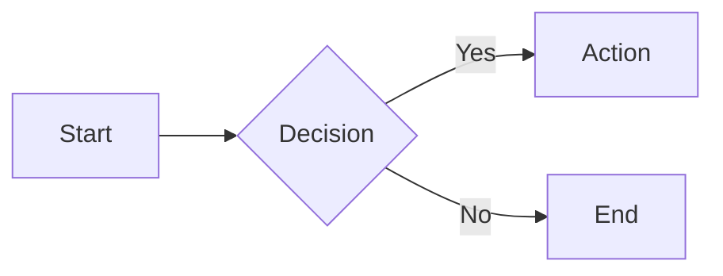
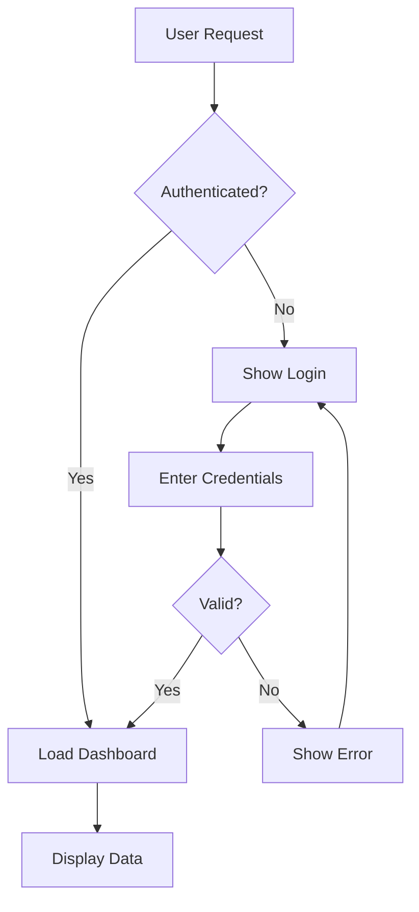
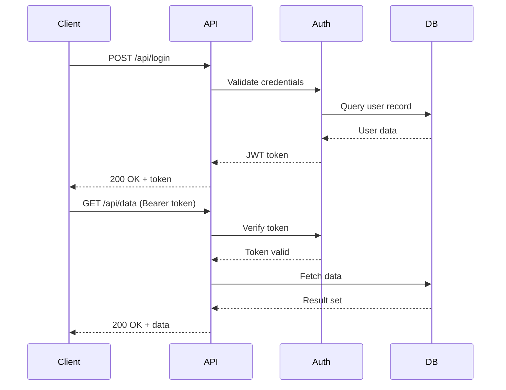
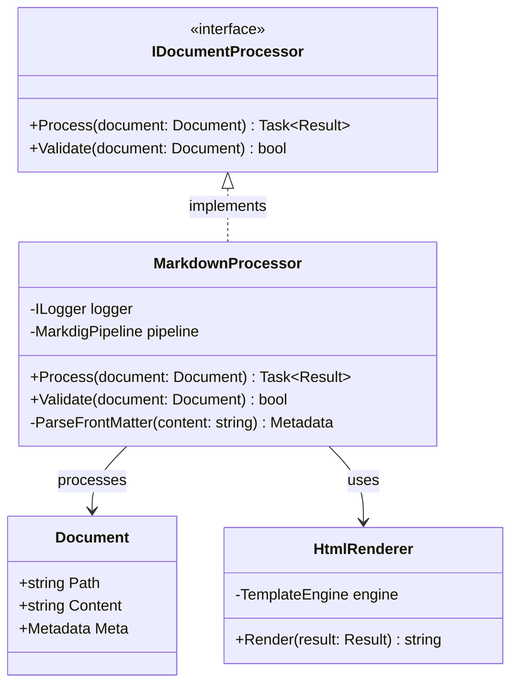
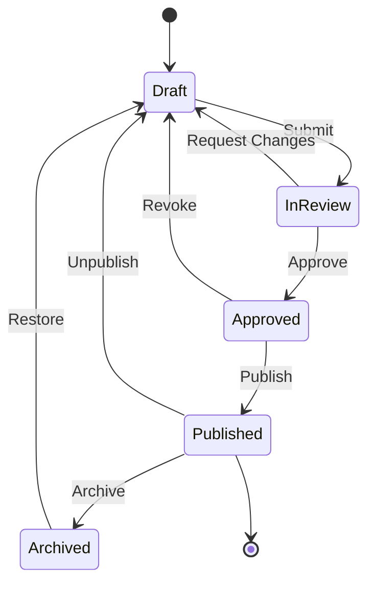
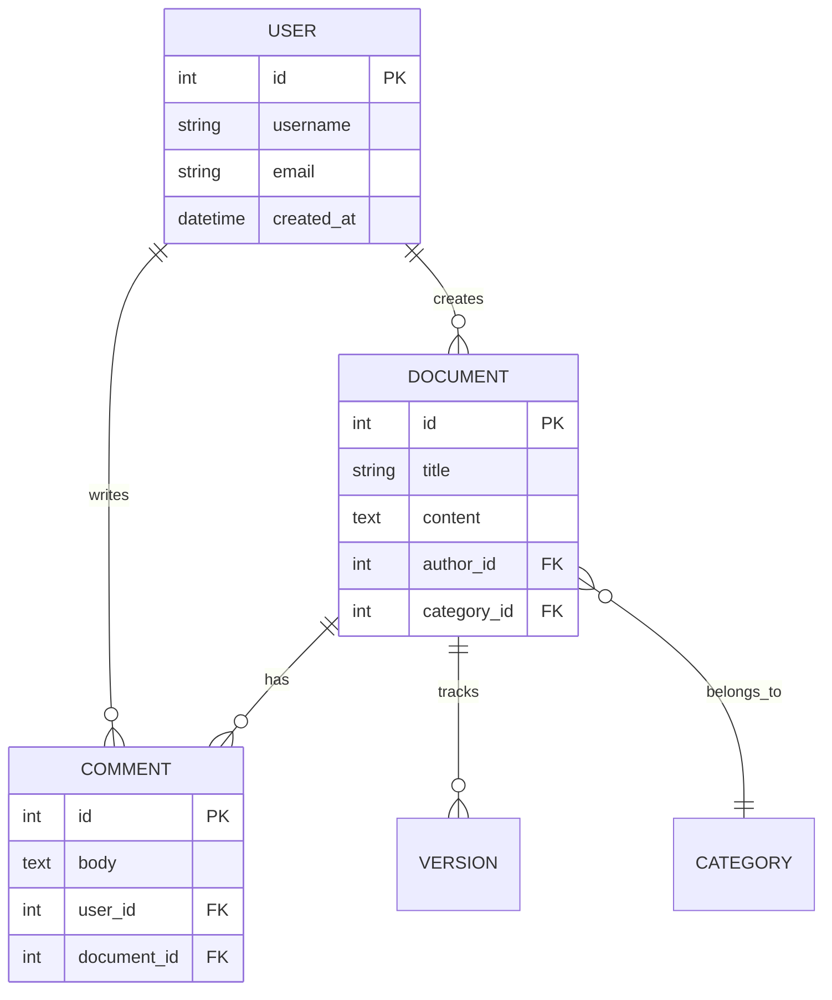
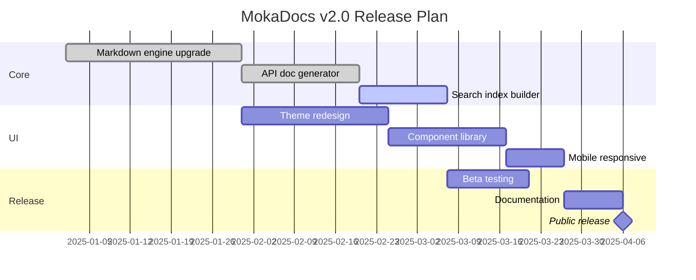
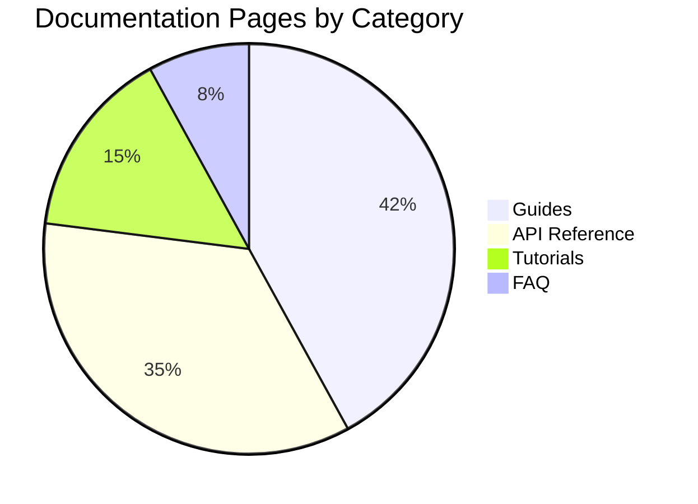
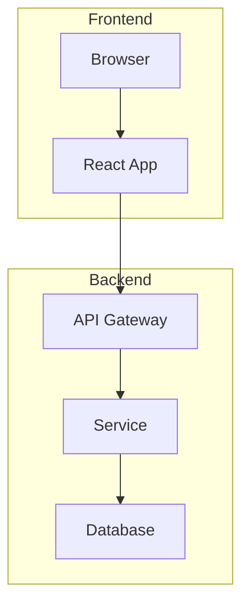
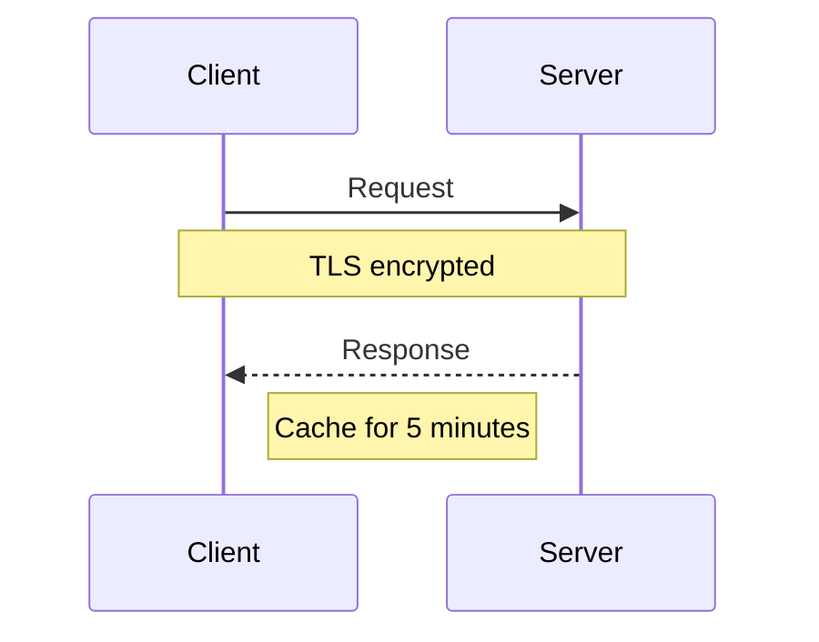

# Mermaid Diagrams

MokaDocs has built-in support for [Mermaid](https://mermaid.js.org/) diagrams. Mermaid lets you create diagrams and visualizations using a text-based syntax directly in your Markdown files. Diagrams are rendered client-side using the Mermaid.js library loaded from a CDN.

## Basic Usage

To create a diagram, use a fenced code block with `mermaid` as the language identifier:

````markdown

````


MokaDocs automatically detects `mermaid` code blocks and renders them as interactive SVG diagrams instead of displaying the raw syntax.

## Theme Support

Mermaid diagrams automatically adapt to the current color scheme of your documentation site. When a user switches between light and dark mode, diagrams re-render with appropriate colors and contrast levels. No additional configuration is needed.

## Diagram Types

Mermaid supports a wide variety of diagram types. Below are examples of the most commonly used types in technical documentation.

### Flowchart

Flowcharts describe processes and workflows with nodes and directional edges.

````markdown

````


Flowchart direction options:
- `TD` or `TB` — Top to bottom
- `BT` — Bottom to top
- `LR` — Left to right
- `RL` — Right to left

Node shapes:
- `[Text]` — Rectangle
- `(Text)` — Rounded rectangle
- `{Text}` — Diamond (decision)
- `([Text])` — Stadium
- `[[Text]]` — Subroutine
- `[(Text)]` — Cylinder (database)
- `((Text))` — Circle

### Sequence Diagram

Sequence diagrams show interactions between participants over time. They are excellent for documenting API flows, service communication, and protocol exchanges.

````markdown

````


Arrow types:
- `->>` — Solid line with arrowhead (synchronous)
- `-->>` — Dashed line with arrowhead (response)
- `--)` — Solid line with open arrow (asynchronous)
- `--x` — Dashed line with cross (lost message)

### Class Diagram

Class diagrams represent the structure of a system by showing classes, their attributes, methods, and relationships. These are particularly useful for .NET API documentation.

````markdown

````


Relationship types:
- `<|--` — Inheritance
- `<|..` — Implementation
- `-->` — Association
- `..>` — Dependency
- `--o` — Aggregation
- `--*` — Composition

### State Diagram

State diagrams depict the states of an object and the transitions between them.

````markdown

````


### Entity Relationship Diagram

ER diagrams model database schemas and the relationships between entities.

````markdown

````


### Gantt Chart

Gantt charts are useful for project timelines and scheduling.

````markdown

````


### Pie Chart

Pie charts display proportional data.

````markdown

````


## Tips for Complex Diagrams

### Keep It Readable

Diagrams are most effective when they communicate a concept clearly. If a diagram becomes too complex, consider splitting it into multiple smaller diagrams with explanatory text between them.

### Use Subgraphs for Grouping

In flowcharts, use `subgraph` blocks to group related nodes:

````markdown

````


### Add Notes in Sequence Diagrams

Use notes to annotate sequence diagrams with additional context:

````markdown

````


### Escape Special Characters

If your diagram labels contain special characters, wrap them in quotes:

```
A["Node with (parentheses)"] --> B["Node with {braces}"]
```

### Test Incrementally

When building complex diagrams, add elements one at a time and preview after each addition. A single syntax error can prevent the entire diagram from rendering. The Mermaid Live Editor at [mermaid.live](https://mermaid.live) is a useful tool for testing diagram syntax independently.
