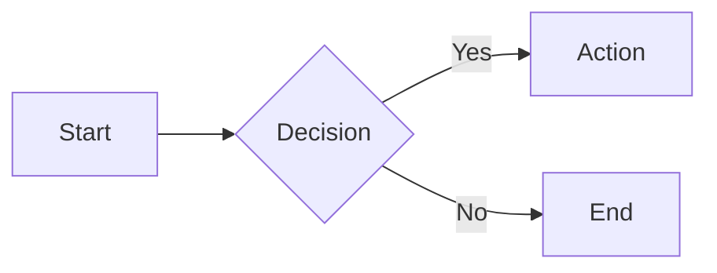
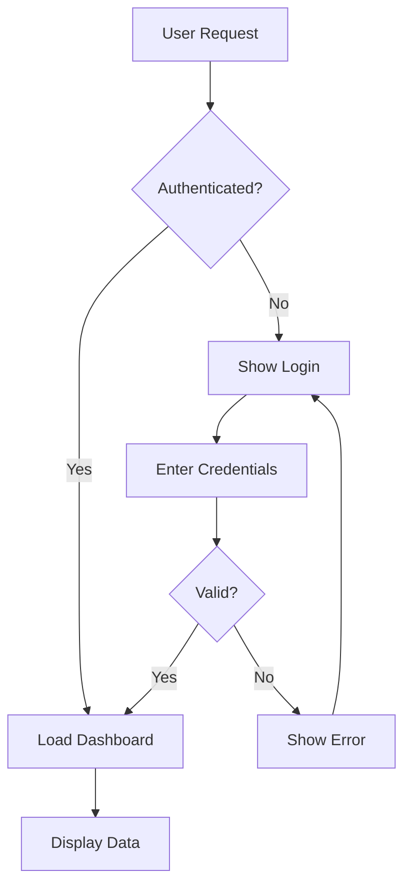
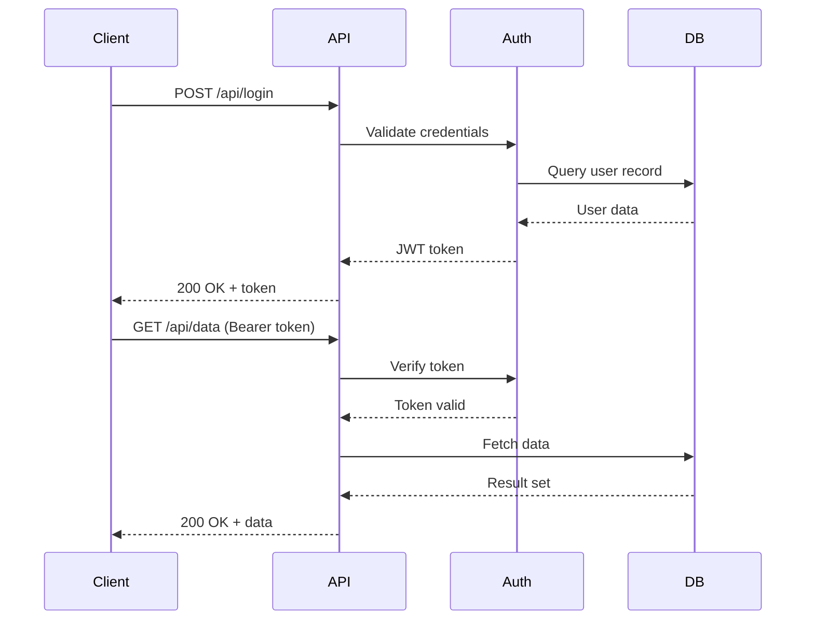
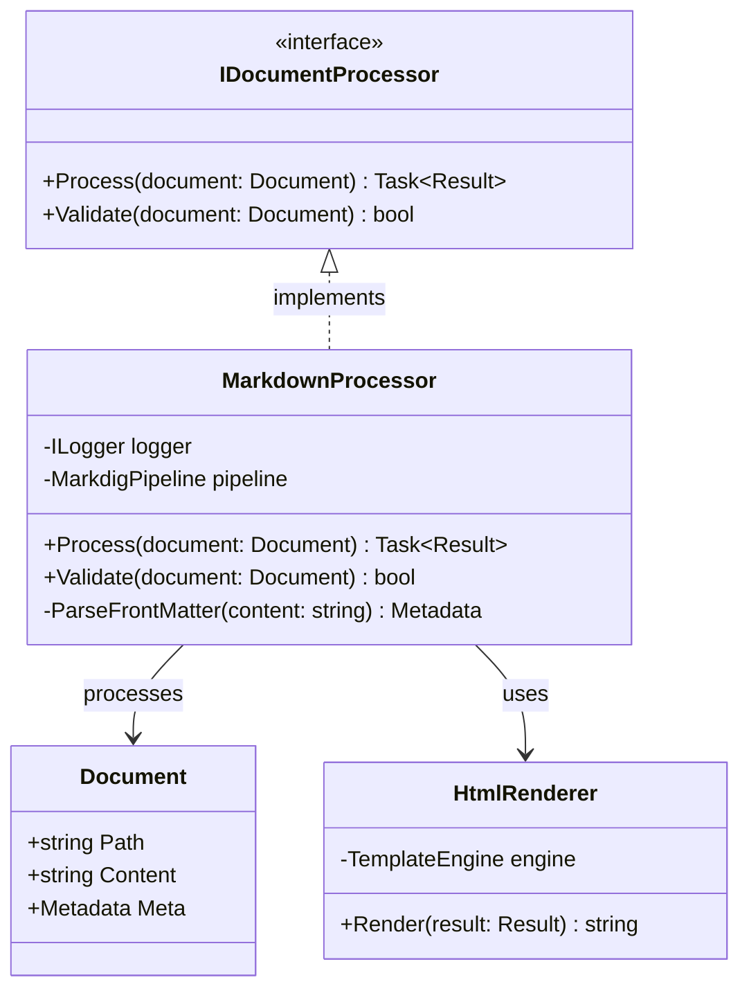
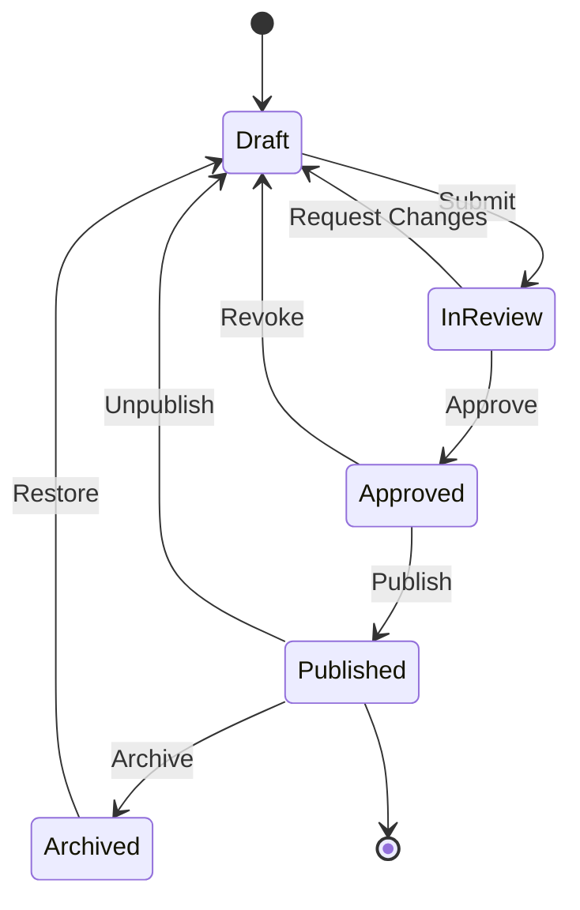
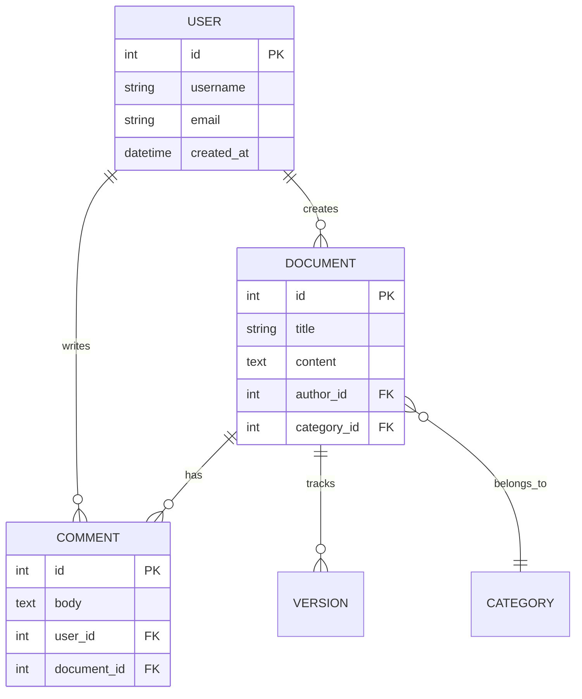
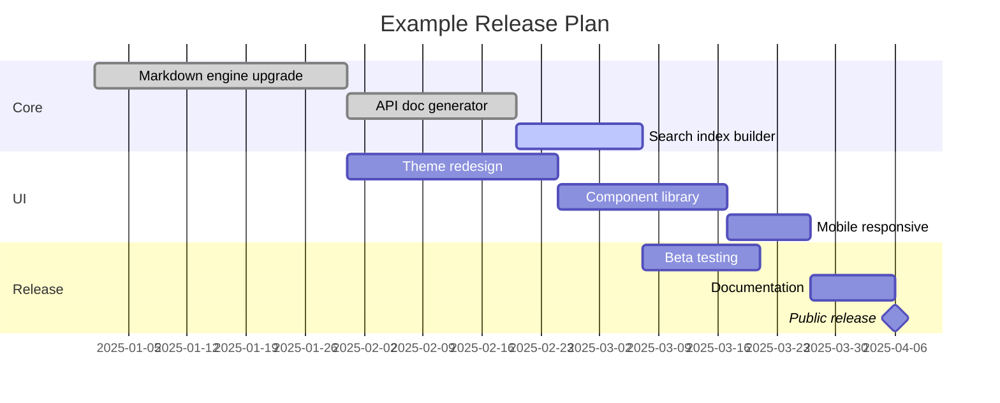
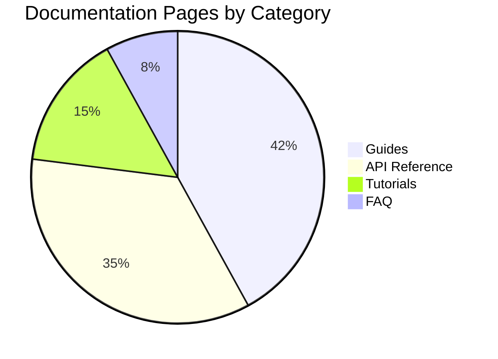
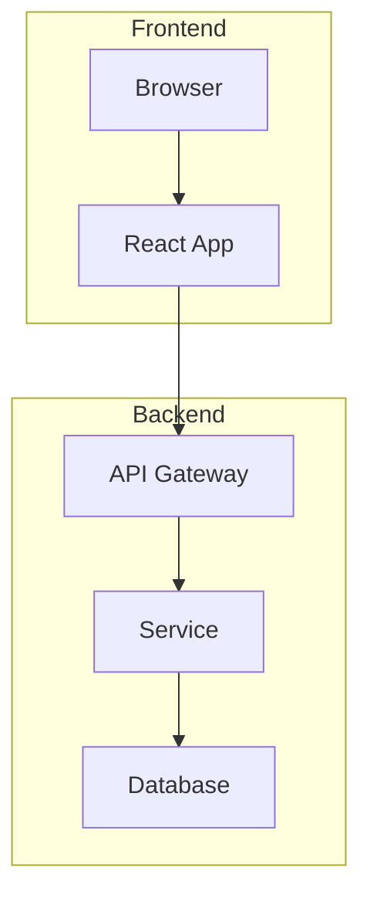
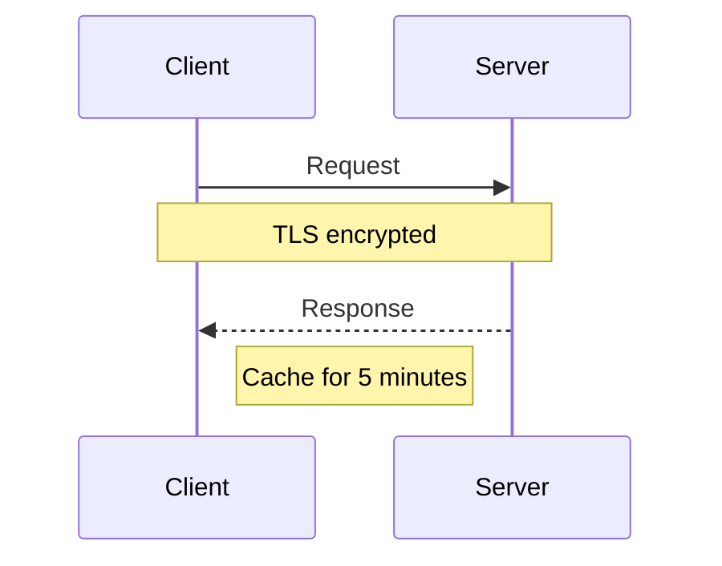

# Mermaid Diagrams

MokaDocs renders [Mermaid](https://mermaid.js.org/) diagrams written in fenced code blocks. The build puts the diagram source in the page, and the default theme draws it in the browser with Mermaid 11. The theme loads the Mermaid script from cdn.jsdelivr.net, and only on pages that contain a diagram. A reader who can't reach the CDN sees the diagram source as text.

## Basic Usage

To create a diagram, use a fenced code block with `mermaid` as the language identifier:

````markdown

```mermaid
flowchart LR
    A[Start] --> B{Decision}
    B -->|Yes| C[Action]
    B -->|No| D[End]
```
````


```mermaid
flowchart LR
    A[Start] --> B{Decision}
    B -->|Yes| C[Action]
    B -->|No| D[End]
```

Mermaid replaces the code block with a static SVG drawing of the diagram.

## Theme Support

Diagrams use Mermaid's `default` theme in light mode and its `dark` theme in dark mode. When a reader switches modes, every diagram on the page is drawn again with the matching theme.

## Diagram Types

Mermaid supports many diagram types. These are the ones most often used in technical documentation.

### Flowchart

Flowcharts describe processes and workflows with nodes and directional edges.

````markdown

```mermaid
flowchart TD
    A[User Request] --> B{Authenticated?}
    B -->|Yes| C[Load Dashboard]
    B -->|No| D[Show Login]
    D --> E[Enter Credentials]
    E --> F{Valid?}
    F -->|Yes| C
    F -->|No| G[Show Error]
    G --> D
    C --> H[Display Data]
```
````


```mermaid
flowchart TD
    A[User Request] --> B{Authenticated?}
    B -->|Yes| C[Load Dashboard]
    B -->|No| D[Show Login]
    D --> E[Enter Credentials]
    E --> F{Valid?}
    F -->|Yes| C
    F -->|No| G[Show Error]
    G --> D
    C --> H[Display Data]
```

Flowchart direction options:
- `TD` or `TB` - Top to bottom
- `BT` - Bottom to top
- `LR` - Left to right
- `RL` - Right to left

Node shapes:
- `[Text]` - Rectangle
- `(Text)` - Rounded rectangle
- `{Text}` - Diamond (decision)
- `([Text])` - Stadium
- `[[Text]]` - Subroutine
- `[(Text)]` - Cylinder (database)
- `((Text))` - Circle

### Sequence Diagram

Sequence diagrams show messages between participants over time, such as API calls between services.

````markdown

```mermaid
sequenceDiagram
    participant Client
    participant API
    participant Auth
    participant DB

    Client->>API: POST /api/login
    API->>Auth: Validate credentials
    Auth->>DB: Query user record
    DB-->>Auth: User data
    Auth-->>API: JWT token
    API-->>Client: 200 OK + token

    Client->>API: GET /api/data (Bearer token)
    API->>Auth: Verify token
    Auth-->>API: Token valid
    API->>DB: Fetch data
    DB-->>API: Result set
    API-->>Client: 200 OK + data
```
````


```mermaid
sequenceDiagram
    participant Client
    participant API
    participant Auth
    participant DB

    Client->>API: POST /api/login
    API->>Auth: Validate credentials
    Auth->>DB: Query user record
    DB-->>Auth: User data
    Auth-->>API: JWT token
    API-->>Client: 200 OK + token

    Client->>API: GET /api/data (Bearer token)
    API->>Auth: Verify token
    Auth-->>API: Token valid
    API->>DB: Fetch data
    DB-->>API: Result set
    API-->>Client: 200 OK + data
```

Arrow types:
- `->>` - Solid line with an arrowhead
- `-->>` - Dotted line with an arrowhead
- `-)` - Solid line with an open arrow (async)
- `--)` - Dotted line with an open arrow
- `-x` - Solid line with a cross at the end
- `--x` - Dotted line with a cross at the end

### Class Diagram

Class diagrams show classes with their members, and how the classes relate. Stereotypes such as `<<interface>>` and generics written with tildes (`Task~Result~`) work as written.

````markdown

```mermaid
classDiagram
    class IDocumentProcessor {
        <<interface>>
        +Process(document: Document) Task~Result~
        +Validate(document: Document) bool
    }

    class MarkdownProcessor {
        -ILogger logger
        -MarkdigPipeline pipeline
        +Process(document: Document) Task~Result~
        +Validate(document: Document) bool
        -ParseFrontMatter(content: string) Metadata
    }

    class HtmlRenderer {
        -TemplateEngine engine
        +Render(result: Result) string
    }

    class Document {
        +string Path
        +string Content
        +Metadata Meta
    }

    IDocumentProcessor <|.. MarkdownProcessor : implements
    MarkdownProcessor --> Document : processes
    MarkdownProcessor --> HtmlRenderer : uses
```
````


```mermaid
classDiagram
    class IDocumentProcessor {
        <<interface>>
        +Process(document: Document) Task~Result~
        +Validate(document: Document) bool
    }

    class MarkdownProcessor {
        -ILogger logger
        -MarkdigPipeline pipeline
        +Process(document: Document) Task~Result~
        +Validate(document: Document) bool
        -ParseFrontMatter(content: string) Metadata
    }

    class HtmlRenderer {
        -TemplateEngine engine
        +Render(result: Result) string
    }

    class Document {
        +string Path
        +string Content
        +Metadata Meta
    }

    IDocumentProcessor <|.. MarkdownProcessor : implements
    MarkdownProcessor --> Document : processes
    MarkdownProcessor --> HtmlRenderer : uses
```

Relationship types:
- `<|--` - Inheritance
- `<|..` - Implementation
- `-->` - Association
- `..>` - Dependency
- `--o` - Aggregation
- `--*` - Composition

### State Diagram

State diagrams depict the states of an object and the transitions between them.

````markdown

```mermaid
stateDiagram-v2
    [*] --> Draft
    Draft --> InReview : Submit
    InReview --> Draft : Request Changes
    InReview --> Approved : Approve
    Approved --> Published : Publish
    Published --> Archived : Archive
    Archived --> Draft : Restore
    Published --> Draft : Unpublish
    Approved --> Draft : Revoke
    Published --> [*]
```
````


```mermaid
stateDiagram-v2
    [*] --> Draft
    Draft --> InReview : Submit
    InReview --> Draft : Request Changes
    InReview --> Approved : Approve
    Approved --> Published : Publish
    Published --> Archived : Archive
    Archived --> Draft : Restore
    Published --> Draft : Unpublish
    Approved --> Draft : Revoke
    Published --> [*]
```

### Entity Relationship Diagram

ER diagrams model database schemas and the relationships between entities.

````markdown

```mermaid
erDiagram
    USER ||--o{ DOCUMENT : creates
    USER ||--o{ COMMENT : writes
    DOCUMENT ||--o{ COMMENT : has
    DOCUMENT ||--o{ VERSION : tracks
    DOCUMENT }o--|| CATEGORY : belongs_to

    USER {
        int id PK
        string username
        string email
        datetime created_at
    }
    DOCUMENT {
        int id PK
        string title
        text content
        int author_id FK
        int category_id FK
    }
    COMMENT {
        int id PK
        text body
        int user_id FK
        int document_id FK
    }
```
````


```mermaid
erDiagram
    USER ||--o{ DOCUMENT : creates
    USER ||--o{ COMMENT : writes
    DOCUMENT ||--o{ COMMENT : has
    DOCUMENT ||--o{ VERSION : tracks
    DOCUMENT }o--|| CATEGORY : belongs_to

    USER {
        int id PK
        string username
        string email
        datetime created_at
    }
    DOCUMENT {
        int id PK
        string title
        text content
        int author_id FK
        int category_id FK
    }
    COMMENT {
        int id PK
        text body
        int user_id FK
        int document_id FK
    }
```

### Gantt Chart

Gantt charts are useful for project timelines and scheduling.

````markdown

```mermaid
gantt
    title Example Release Plan
    dateFormat YYYY-MM-DD
    section Core
        Markdown engine upgrade  :done, core1, 2025-01-01, 30d
        API doc generator        :done, core2, after core1, 20d
        Search index builder     :active, core3, after core2, 15d
    section UI
        Theme redesign           :ui1, after core1, 25d
        Component library        :ui2, after ui1, 20d
        Mobile responsive        :ui3, after ui2, 10d
    section Release
        Beta testing             :rel1, after core3, 14d
        Documentation            :rel2, after ui3, 10d
        Public release           :milestone, rel3, after rel2, 0d
```
````


```mermaid
gantt
    title Example Release Plan
    dateFormat YYYY-MM-DD
    section Core
        Markdown engine upgrade  :done, core1, 2025-01-01, 30d
        API doc generator        :done, core2, after core1, 20d
        Search index builder     :active, core3, after core2, 15d
    section UI
        Theme redesign           :ui1, after core1, 25d
        Component library        :ui2, after ui1, 20d
        Mobile responsive        :ui3, after ui2, 10d
    section Release
        Beta testing             :rel1, after core3, 14d
        Documentation            :rel2, after ui3, 10d
        Public release           :milestone, rel3, after rel2, 0d
```

### Pie Chart

Pie charts display proportional data.

````markdown

```mermaid
pie title Documentation Pages by Category
    "Guides" : 42
    "API Reference" : 35
    "Tutorials" : 15
    "FAQ" : 8
```
````


```mermaid
pie title Documentation Pages by Category
    "Guides" : 42
    "API Reference" : 35
    "Tutorials" : 15
    "FAQ" : 8
```

## Tips for Complex Diagrams

### Keep It Readable

If a diagram gets hard to follow, split it into smaller diagrams with text between them.

### Use Subgraphs for Grouping

In flowcharts, use `subgraph` blocks to group related nodes:

````markdown

```mermaid
flowchart TD
    subgraph Frontend
        A[Browser] --> B[React App]
    end
    subgraph Backend
        C[API Gateway] --> D[Service]
        D --> E[Database]
    end
    B --> C
```
````


```mermaid
flowchart TD
    subgraph Frontend
        A[Browser] --> B[React App]
    end
    subgraph Backend
        C[API Gateway] --> D[Service]
        D --> E[Database]
    end
    B --> C
```

### Add Notes in Sequence Diagrams

Use notes to annotate sequence diagrams with additional context:

````markdown

```mermaid
sequenceDiagram
    Client->>Server: Request
    Note over Client,Server: TLS encrypted
    Server-->>Client: Response
    Note right of Client: Cache for 5 minutes
```
````


```mermaid
sequenceDiagram
    Client->>Server: Request
    Note over Client,Server: TLS encrypted
    Server-->>Client: Response
    Note right of Client: Cache for 5 minutes
```

### Special Characters

Write the diagram source the way Mermaid expects it. The build HTML-encodes the source and Mermaid decodes it before parsing, so `-->`, `<<interface>>` and `List~string~` need no escaping, including after a light/dark switch.

Put a node label in quotes when it contains parentheses or braces:

```
A["Node with (parentheses)"] --> B["Node with {braces}"]
```

Mermaid removes angle brackets from flowchart node labels, so `A["List<string>"]` shows only "List". Use Mermaid's entity codes `#60;` for `<` and `#62;` for `>` instead:

````markdown
```mermaid
flowchart LR
    A["List#60;string#62;"] --> B["Dictionary#60;string, int#62;"]
```
````

```mermaid
flowchart LR
    A["List#60;string#62;"] --> B["Dictionary#60;string, int#62;"]
```

### Test Incrementally

A syntax error replaces that diagram with Mermaid's "Syntax error in text" message; the other diagrams on the page still render. For a complex diagram, add a few lines at a time and check the result, or try the syntax first in the [Mermaid Live Editor](https://mermaid.live).
