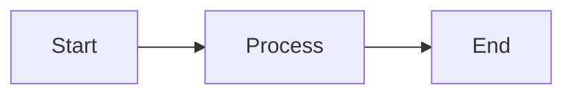

# Markdown & Content

MokaDocs uses [Markdig](https://github.com/xoofx/markdig) as its Markdown processing engine, providing full CommonMark support along with a rich set of extensions enabled by default. This page covers every Markdown feature available to you when writing documentation.

## Standard Markdown

All standard CommonMark syntax is fully supported. This includes headings, paragraphs, bold, italic, inline code, blockquotes, ordered and unordered lists, links, images, horizontal rules, and fenced code blocks.

```markdown
# Heading 1
## Heading 2
### Heading 3

This is a paragraph with **bold**, *italic*, and `inline code`.

> This is a blockquote.

- Unordered item
- Another item

1. Ordered item
2. Another item

[Link text](https://example.com)


---
```

## Advanced Extensions

MokaDocs enables several Markdig extensions by default, giving you access to powerful formatting options without any additional configuration.

### Tables

Create tables using the standard pipe syntax. Column alignment is controlled with colons in the separator row.

```markdown
| Feature        | Status      | Notes                  |
|:---------------|:-----------:|------------------------:|
| Left-aligned   | Centered    | Right-aligned          |
| CommonMark     | Supported   | Full compliance        |
| Extensions     | Enabled     | Batteries included     |
```

| Feature        | Status      | Notes                  |
|:---------------|:-----------:|------------------------:|
| Left-aligned   | Centered    | Right-aligned          |
| CommonMark     | Supported   | Full compliance        |
| Extensions     | Enabled     | Batteries included     |

### Footnotes

Add footnotes to provide supplementary information without interrupting the flow of your text.

```markdown
MokaDocs uses Markdig[^1] for Markdown processing, which supports
CommonMark[^2] and many extensions.

[^1]: Markdig is a fast, powerful, and extensible Markdown processor for .NET.
[^2]: CommonMark is a strongly defined, highly compatible specification of Markdown.
```

MokaDocs uses Markdig[^1] for Markdown processing, which supports CommonMark[^2] and many extensions.

[^1]: Markdig is a fast, powerful, and extensible Markdown processor for .NET.
[^2]: CommonMark is a strongly defined, highly compatible specification of Markdown.

### Task Lists

Create interactive-style checklists using bracket syntax.

```markdown
- [x] Set up MokaDocs project
- [x] Write first documentation page
- [ ] Configure sidebar navigation
- [ ] Deploy to production
```

- [x] Set up MokaDocs project
- [x] Write first documentation page
- [ ] Configure sidebar navigation
- [ ] Deploy to production

### Auto-Links

URLs and email addresses are automatically converted into clickable links without needing explicit link syntax.

```markdown
Visit https://example.com for more information.
Contact support@example.com for help.
```

### Emoji

Use emoji shortcodes in your Markdown content. Shortcodes are surrounded by colons.

```markdown
:rocket: Launch your docs in minutes
:bulb: Pro tip for better documentation
:warning: Be careful with this setting
:white_check_mark: All tests passing
```

:rocket: Launch your docs in minutes
:bulb: Pro tip for better documentation
:warning: Be careful with this setting
:white_check_mark: All tests passing

## YAML Front Matter

Every Markdown file can include YAML front matter at the top of the file, enclosed by triple dashes. Front matter is used to set page metadata such as the title, ordering, and other properties.

```markdown
---
title: My Page Title
order: 3
tags:
  - guide
  - getting-started
---

# Page content starts here
```

Common front matter fields:

| Field   | Type     | Description                                      |
|---------|----------|--------------------------------------------------|
| `title` | string   | The page title used in navigation and the browser tab |
| `order` | number   | Controls the sort order in the sidebar           |
| `tags`  | string[] | Tags for search categorization                   |

## Auto-Generated Heading IDs

MokaDocs automatically generates GitHub-style anchor IDs for all headings. This enables deep linking to any section of your documentation.

The ID generation rules follow GitHub conventions:

- Text is converted to lowercase
- Spaces are replaced with hyphens
- Special characters are removed
- Duplicate IDs are disambiguated with numeric suffixes

```markdown
## Getting Started        → #getting-started
## API Reference          → #api-reference
## What's New in v2.0?    → #whats-new-in-v20
## FAQ                    → #faq
## FAQ (duplicate)        → #faq-1
```

You can link to any heading within a page or across pages:

```markdown
See the [Getting Started](#getting-started) section.
Check out the [API docs](./api-docs.md#configuration) for configuration options.
```

## Syntax Highlighting

Fenced code blocks with a language identifier receive automatic syntax highlighting. MokaDocs supports a wide range of programming languages.

````markdown
```csharp
public class HelloWorld
{
    public static void Main(string[] args)
    {
        Console.WriteLine("Hello, MokaDocs!");
    }
}
```
````

```csharp
public class HelloWorld
{
    public static void Main(string[] args)
    {
        Console.WriteLine("Hello, MokaDocs!");
    }
}
```

Supported languages include (but are not limited to): `csharp`, `javascript`, `typescript`, `python`, `json`, `xml`, `html`, `css`, `bash`, `sql`, `yaml`, `markdown`, `fsharp`, `go`, `rust`, `java`, `kotlin`, `swift`, `ruby`, `php`, and many more.

### Line Numbers

Add the `has-line-numbers` class to a code block to display line numbers alongside the code. This is particularly useful for longer code samples where you need to reference specific lines.

````markdown
```csharp has-line-numbers
using System;

namespace MyApp
{
    public class Calculator
    {
        public int Add(int a, int b)
        {
            return a + b;
        }

        public int Subtract(int a, int b)
        {
            return a - b;
        }
    }
}
```
````

```csharp has-line-numbers
using System;

namespace MyApp
{
    public class Calculator
    {
        public int Add(int a, int b)
        {
            return a + b;
        }

        public int Subtract(int a, int b)
        {
            return a - b;
        }
    }
}
```

### Copy Button

Every code block includes a copy button in the top-right corner. Clicking it copies the code content to the clipboard.

The copy button works in both HTTPS and HTTP environments (including the local dev server). It uses `navigator.clipboard` when available and automatically falls back to `document.execCommand('copy')` in contexts where the Clipboard API is not supported, ensuring reliable copy behavior everywhere.

## Admonitions / Callouts

Admonitions (also called callouts) draw attention to important information using visually distinct blocks. MokaDocs uses the `:::` fenced container syntax.

### Basic Syntax

```markdown
::: note
This is a note admonition with the default title.
:::
```

::: note
This is a note admonition with the default title.
:::

### Custom Titles

Provide a custom title after the admonition type:

```markdown
::: tip Hot Tip
You can customize the title of any admonition by adding text after the type.
:::
```

::: tip Hot Tip
You can customize the title of any admonition by adding text after the type.
:::

### Admonition Types

MokaDocs supports seven admonition types, each with its own icon and color scheme:

```markdown
::: note
Highlights information that users should take into account, even when skimming.
:::

::: tip
Optional information to help a user be more successful.
:::

::: info
General information that provides additional context.
:::

::: warning
Critical content demanding immediate user attention due to potential risks.
:::

::: danger
Negative potential consequences of an action. Use sparingly.
:::

::: caution
Advises about risks or negative outcomes of certain actions.
:::

::: important
Key information users need to know to achieve their goal.
:::
```

::: note
Highlights information that users should take into account, even when skimming.
:::

::: tip
Optional information to help a user be more successful.
:::

::: info
General information that provides additional context.
:::

::: warning
Critical content demanding immediate user attention due to potential risks.
:::

::: danger
Negative potential consequences of an action. Use sparingly.
:::

::: caution
Advises about risks or negative outcomes of certain actions.
:::

::: important
Key information users need to know to achieve their goal.
:::

### Rich Content in Admonitions

Admonitions can contain any Markdown content, including code blocks, lists, tables, and links.

```markdown
::: tip Using Dependency Injection
You can register MokaDocs services in your DI container:

1. Add the NuGet package
2. Call the registration method:

\`\`\`csharp
services.AddMokaDocs(options =>
{
    options.Title = "My Docs";
});
\`\`\`

See the [configuration guide](./configuration.md) for more details.
:::
```

## Tabbed Content

Use tabbed content blocks to present alternative versions of information side by side. This is ideal for showing the same concept in different languages, platforms, or configurations.

### Basic Syntax

```markdown
=== "npm"
\`\`\`bash
npm install my-package
\`\`\`
=== "yarn"
\`\`\`bash
yarn add my-package
\`\`\`
=== "pnpm"
\`\`\`bash
pnpm add my-package
\`\`\`
===
```

=== "npm"
```bash
npm install my-package
```
=== "yarn"
```bash
yarn add my-package
```
=== "pnpm"
```bash
pnpm add my-package
```
===

### Tabs with Mixed Content

Tabs are not limited to code blocks. Each tab can contain any Markdown content.

```markdown
=== "Windows"
1. Download the installer from the releases page
2. Run `setup.exe`
3. Follow the installation wizard

=== "macOS"
Install via Homebrew:
\`\`\`bash
brew install mokadocs
\`\`\`

=== "Linux"
Install via the package manager for your distribution:
\`\`\`bash
# Debian/Ubuntu
sudo apt install mokadocs

# Fedora
sudo dnf install mokadocs
\`\`\`
===
```

::: tip Tab Synchronization
When multiple tabbed content blocks on the same page share identical tab labels, selecting a tab in one block automatically selects the matching tab in all other blocks. This provides a consistent experience when a page shows multiple examples for different platforms.
:::

## Additional Extensions

Beyond the features documented above, MokaDocs also supports the following special Markdown extensions through its plugin and extension system:

### Mermaid Diagrams

Use the `mermaid` info string on fenced code blocks to render diagrams using Mermaid:

````markdown

````

### Interactive REPL Code Blocks

Use the `csharp-repl` (or `cs-repl`) info string to create interactive, runnable C# code blocks. Requires the REPL plugin to be enabled.

````markdown
```csharp-repl
Console.WriteLine("Hello from the REPL!");
```
````

### Blazor Preview Blocks

Use the `blazor-preview` (or `razor-preview`) info string to create live-rendered Blazor component previews. Requires the Blazor Preview plugin to be enabled.

````markdown
```blazor-preview
<h3>Hello, @Name!</h3>
@code {
    string Name = "World";
}
```
````

### Changelog Containers

Use the `:::changelog` fenced container to render rich release timeline UI. Requires the Changelog plugin to be enabled.

````markdown
:::changelog
## v1.0.0 — 2025-01-01

### Added
- Initial release
:::
````

## Combining Features

All of these features can be combined freely. Here is an example using admonitions inside tabs:

```markdown
=== "Development"

::: tip
Run the dev server with hot reload:
\`\`\`bash
mokadocs serve --watch
\`\`\`
:::

=== "Production"

::: warning
Always build before deploying:
\`\`\`bash
mokadocs build --output ./dist
\`\`\`
:::

===
```
