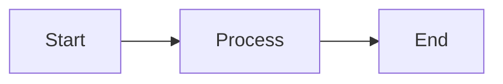

# Markdown & Content

MokaDocs parses pages with [Markdig](https://github.com/xoofx/markdig): CommonMark plus Markdig's advanced extensions and emoji shortcodes. On top of that it adds admonitions, tabbed content, [UI components](/guide/components) and [Mermaid diagrams](/guide/diagrams).

## Standard Markdown

CommonMark syntax works as written: headings, emphasis, inline code, blockquotes, lists, links, images, horizontal rules and fenced code blocks.

```markdown
# Heading 1
## Heading 2
### Heading 3

This is a paragraph with **bold**, *italic*, and `inline code`.

> This is a blockquote.

- Unordered item
- Another item

1. Ordered item
2. Another item

[Link text](https://example.com)


---
```

## Advanced Extensions

These Markdig extensions are always on.

### Tables

Tables use the pipe syntax. Colons in the separator row set each column's alignment.

```markdown
| Feature      | Status    | Notes         |
|:-------------|:---------:|--------------:|
| Left-aligned | Centered  | Right-aligned |
| Tables       | Supported | Pipe syntax   |
```

| Feature      | Status    | Notes         |
|:-------------|:---------:|--------------:|
| Left-aligned | Centered  | Right-aligned |
| Tables       | Supported | Pipe syntax   |

### Footnotes

A reference such as `[^1]` links to its definition. Definitions are collected into a numbered list at the bottom of the page, wherever you write them.

```markdown
MokaDocs parses Markdown with Markdig[^1], which follows CommonMark[^2].

[^1]: Markdig is a Markdown processor for .NET.
[^2]: CommonMark is a specification of Markdown syntax.
```

MokaDocs parses Markdown with Markdig[^1], which follows CommonMark[^2].

[^1]: Markdig is a Markdown processor for .NET.
[^2]: CommonMark is a specification of Markdown syntax.

The footnotes for this example are at the bottom of this page.

### Task Lists

`[x]` or `[ ]` at the start of a list item renders a checkbox. The checkboxes are read-only.

```markdown
- [x] Set up MokaDocs project
- [x] Write first documentation page
- [ ] Configure sidebar navigation
- [ ] Deploy to production
```

- [x] Set up MokaDocs project
- [x] Write first documentation page
- [ ] Configure sidebar navigation
- [ ] Deploy to production

### Auto-Links

Bare URLs starting with `https://`, `http://`, `ftp://` or `www.` become links. A bare email address stays plain text; put it in angle brackets to get a `mailto:` link.

```markdown
Visit https://example.com for more information.
Contact <support@example.com> for help.
```

Visit https://example.com for more information.
Contact <support@example.com> for help.

### Emoji

Shortcodes between colons become emoji. Text smileys such as `:)` are converted too.

```markdown
:rocket: Version 1.0 is out
:bulb: A tip for this page
:warning: Check this setting before you deploy
:white_check_mark: All tests passing
```

:rocket: Version 1.0 is out
:bulb: A tip for this page
:warning: Check this setting before you deploy
:white_check_mark: All tests passing

## YAML Front Matter

A page can start with a YAML block between two `---` lines. It sets page metadata such as the title and sidebar order.

```markdown
---
title: My Page Title
order: 3
tags:
  - guide
  - getting-started
---

# Page content starts here
```

The most common fields:

| Field   | Type            | Description |
|---------|-----------------|-------------|
| `title` | string          | Used for the sidebar, the browser tab and search. A page without one is called "Untitled"; the first heading is not used instead. |
| `order` | number          | Sort order in the sidebar |
| `tags`  | list of strings | Extra search keywords. Search matches them; the default theme does not show them. |

Write `tags` as a YAML list. If the block does not parse (`tags: setup, yaml` is enough to break it), MokaDocs ignores the whole block, so the page loses its title too. The build reports a warning that names the file. [Front Matter](/configuration/front-matter) lists every field.

## Heading IDs

Every heading gets an `id`, including headings inside admonitions, cards, tabs and steps. The id is built from the heading text:

- Letters are lowercased, and accented letters become plain ASCII (`Café` becomes `cafe`).
- Spaces become hyphens.
- Punctuation is removed, except `.`, `-` and `_`.
- Anything before the first letter is removed, so a leading number disappears.
- A repeated id gets a numeric suffix: `-1`, `-2` and so on.

```markdown
## Getting Started       → #getting-started
## What's New in v2.0?   → #whats-new-in-v2.0
## C# Tips               → #c-tips
## 2.0 Release           → #release
## FAQ                   → #faq
## FAQ                   → #faq-1
```

To pick the id yourself, put `{#your-id}` at the end of the heading:

```markdown
## 2.0 Release {#release-2-0}
```

### Linking to Headings

Link to a heading on the same page with `#id`, or on another page with the page link plus `#id`:

```markdown
See the [Getting Started](#getting-started) section.
Check out the [API docs](./api-docs.md#configuration) for configuration options.
```

Relative links and image paths are resolved at build time against the file that contains them, and written as links from the site root. In `docs/guide/markdown.md`, `./api-docs.md#configuration` becomes `/guide/api-docs#configuration`: the `.md` extension is dropped, and `index.md` stands for its folder. If the site has a `build.basePath`, it is added in front. Resolution works from file paths, so a link does not follow a `route:` override in the target page's front matter.

## Syntax Highlighting

The default theme highlights fenced code blocks in the browser, using the language named after the opening fence.

````markdown
```csharp
public class HelloWorld
{
    public static void Main(string[] args)
    {
        Console.WriteLine("Hello, MokaDocs!");
    }
}
```
````

```csharp
public class HelloWorld
{
    public static void Main(string[] args)
    {
        Console.WriteLine("Hello, MokaDocs!");
    }
}
```

The highlighter knows these languages, with aliases in parentheses: `csharp` (`cs`), `fsharp` (`fs`), `javascript` (`js`, `jsx`), `typescript` (`ts`, `tsx`), `python` (`py`), `java`, `kotlin` (`kt`), `swift`, `go`, `rust`, `ruby` (`rb`), `php`, `razor` (`blazor`, `cshtml`), `html`, `xml`, `css`, `json`, `yaml` (`yml`), `toml`, `ini` (`cfg`, `conf`), `bash` (`sh`, `shell`), `powershell` (`ps1`, `pwsh`), `sql`, `graphql` (`gql`), `proto` (`protobuf`), `docker` (`dockerfile`), `markdown` (`md`) and `diff`. A block in any other language, or with no language, is shown as plain text.

Every code block also gets a language label (when it names a language) and a copy button.

### Line Numbers

Code blocks with three or more lines get line numbers, like the example above. There is no per-block setting. To turn them off for the whole site:

```yaml
theme:
  options:
    showLineNumbers: false
```

### Copy Button

A **Copy** button appears in the top-right corner of a code block when you hover over it. It uses the Clipboard API on HTTPS pages and on `localhost`, and falls back to `document.execCommand('copy')` elsewhere. Set `showCopyButton: false` under `theme.options` to remove it.

## Admonitions / Callouts

An admonition is a `:::` block with a type. It renders as a colored box with an icon and a title.

### Basic Syntax

```markdown
::: note
This is a note admonition with the default title.
:::
```

::: note
This is a note admonition with the default title.
:::

The title defaults to the type name.

### Custom Titles

Text after the type replaces the title:

```markdown
::: tip Hot Tip
You can customize the title of any admonition by adding text after the type.
:::
```

::: tip Hot Tip
You can customize the title of any admonition by adding text after the type.
:::

### Admonition Types

There are seven types. `caution` uses the same icon and color as `warning`, and `important` uses the same color as `info`.

```markdown
::: note
Something readers should know, even when skimming.
:::

::: tip
An optional suggestion.
:::

::: info
Background or extra context.
:::

::: warning
Something that goes wrong if ignored.
:::

::: danger
An action that can lose data or break a build.
:::

::: caution
A risk to weigh before you continue.
:::

::: important
A step readers must not skip.
:::
```

::: note
Something readers should know, even when skimming.
:::

::: tip
An optional suggestion.
:::

::: info
Background or extra context.
:::

::: warning
Something that goes wrong if ignored.
:::

::: danger
An action that can lose data or break a build.
:::

::: caution
A risk to weigh before you continue.
:::

::: important
A step readers must not skip.
:::

A word after `:::` that MokaDocs does not recognize gives a plain `<div>` with that word as its class, so a mistyped type such as `::: foo` renders `<div class="foo">`.

### Rich Content in Admonitions

An admonition can hold any Markdown, such as a numbered list and a code block:

````markdown
::: tip Using Dependency Injection
To host the docs inside an ASP.NET Core app:

1. Add the `Moka.Docs.AspNetCore` package.
2. Register the services:

```csharp
services.AddMokaDocs(options =>
{
    options.Title = "My Docs";
});
```

See the [ASP.NET Core guide](/guide/aspnetcore) for more details.
:::
````

To put an admonition inside another `:::` block, see [Nesting Blocks](#nesting-blocks).

## Tabbed Content

Tabs show alternative versions of the same content, such as one command for several package managers.

### Basic Syntax

A tab group starts with `=== "Title"`. Each further `=== "Title"` line starts a new tab, and a bare `===` line ends the group. Titles go in double or single quotes.

````markdown
=== "npm"
```bash
npm install my-package
```
=== "yarn"
```bash
yarn add my-package
```
=== "pnpm"
```bash
pnpm add my-package
```
===
````

=== "npm"
```bash
npm install my-package
```
=== "yarn"
```bash
yarn add my-package
```
=== "pnpm"
```bash
pnpm add my-package
```
===

Don't leave out the closing `===`. Without it, the rest of the page ends up in the last tab.

### Tabs with Mixed Content

A tab can hold any Markdown, not only code blocks.

````markdown
=== "Steps"
1. Install the tool with `dotnet tool install -g mokadocs`.
2. Run `mokadocs init` in an empty folder.
3. Run `mokadocs serve`.

=== "Commands"
```bash
dotnet tool install -g mokadocs
mkdir my-docs
cd my-docs
mokadocs init
mokadocs serve
```
===
````

=== "Steps"
1. Install the tool with `dotnet tool install -g mokadocs`.
2. Run `mokadocs init` in an empty folder.
3. Run `mokadocs serve`.

=== "Commands"
```bash
dotnet tool install -g mokadocs
mkdir my-docs
cd my-docs
mokadocs init
mokadocs serve
```
===

Each group switches on its own. The selected tab is not remembered when the page reloads, and groups with the same tab titles do not switch together.

### Nested Tabs

To put a tab group inside a tab, write the outer group with more `=` signs. A tab line or closing line belongs to a group only if it is at least as long as that group's opening line, so the inner `===` lines leave the outer `====` group alone.

````markdown
==== "Windows"
=== "PowerShell"
```powershell
$env:DOTNET_CLI_TELEMETRY_OPTOUT = "1"
```
=== "cmd"
```bat
set DOTNET_CLI_TELEMETRY_OPTOUT=1
```
===
==== "Linux"
```bash
export DOTNET_CLI_TELEMETRY_OPTOUT=1
```
====
````

==== "Windows"
=== "PowerShell"
```powershell
$env:DOTNET_CLI_TELEMETRY_OPTOUT = "1"
```
=== "cmd"
```bat
set DOTNET_CLI_TELEMETRY_OPTOUT=1
```
===
==== "Linux"
```bash
export DOTNET_CLI_TELEMETRY_OPTOUT=1
```
====

## Additional Extensions

MokaDocs also renders these blocks. Three of them get their interactive parts from a plugin, which you enable under `plugins:` in `mokadocs.yaml`.

### Mermaid Diagrams

A code block with the `mermaid` language becomes a diagram. See [Mermaid Diagrams](/guide/diagrams).

````markdown

```mermaid
graph LR
    A[Start] --> B[Process]
    B --> C[End]
```
````

### Interactive REPL Code Blocks

A `csharp-repl` (or `cs-repl`) block gets a **Run** button when the `mokadocs-repl` plugin is enabled. The code runs on the `mokadocs serve` dev server; on a static host the button shows a "server unavailable" message instead of output. Without the plugin the block is an ordinary C# code block. See the [REPL plugin](/plugins/repl).

````markdown
```csharp-repl
Console.WriteLine("Hello from the REPL!");
```
````

### Blazor Preview Blocks

A `blazor-preview` (or `razor-preview`) block renders a Blazor component, with Preview and Source tabs, when the `mokadocs-blazor-preview` plugin is enabled. Without the plugin only the source is shown. See the [Blazor Preview plugin](/plugins/blazor-preview).

````markdown
```blazor-preview
<h3>Hello, @Name!</h3>
@code {
    string Name = "World";
}
```
````

### Changelog Containers

A `:::changelog` block turns release headings (`## v1.0.0 - 2025-01-01`) and their `###` category lists into a release timeline. The `mokadocs-changelog` plugin adds the timeline styling and the category filters. See the [Changelog plugin](/plugins/changelog).

````markdown
:::changelog
## v1.0.0 - 2025-01-01

### Added
- Initial release
:::
````

## Nesting Blocks

Blocks with different fence characters nest as written. An admonition (`:::`) inside a tab (`===`) needs nothing special:

````markdown
=== "Development"

::: tip
Run the dev server. It rebuilds the site and reloads the browser when you save a file:
```bash
mokadocs serve
```
:::

=== "Production"

::: warning
Always build before deploying:
```bash
mokadocs build --output ./dist
```
:::

===
````

A `:::` block inside another `:::` block needs a longer fence on the outside. A line of colons closes a block only if it has at least as many colons as that block's opening line, so write the outer block with four colons and close it with `::::`:

```markdown
::::note Before you deploy
Build the site locally first.

:::warning
With `build.clean: true`, the build deletes the output folder before writing to it.
:::

Then upload the output folder to your host.
::::
```

::::note Before you deploy
Build the site locally first.

:::warning
With `build.clean: true`, the build deletes the output folder before writing to it.
:::

Then upload the output folder to your host.
::::

Add a colon for each level: `:::::` outside `::::` outside `:::`. The rule also applies to `:::` lines inside a fenced code block, so a container whose code sample shows `:::` syntax needs the longer fence too.

With equal fences, the inner block's closing `:::` closes the outer block as well. The leftover `:::` then wraps the content after it in a plain `<div>`, up to the next bare `:::` line.

Tab groups follow the same rule with `=` signs (see [Nested Tabs](#nested-tabs)), and so do the [UI components](/guide/components#combining-components).
