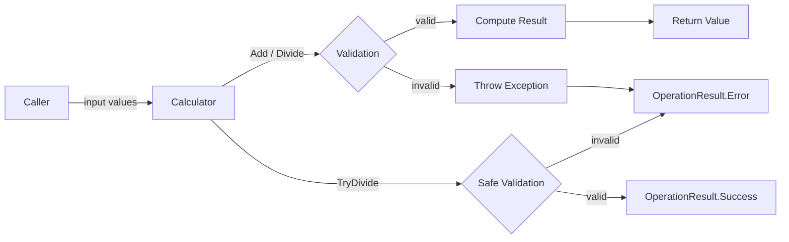
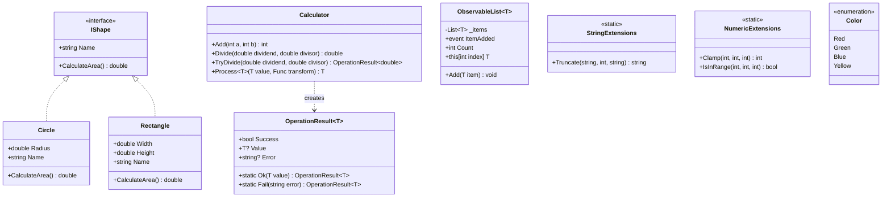
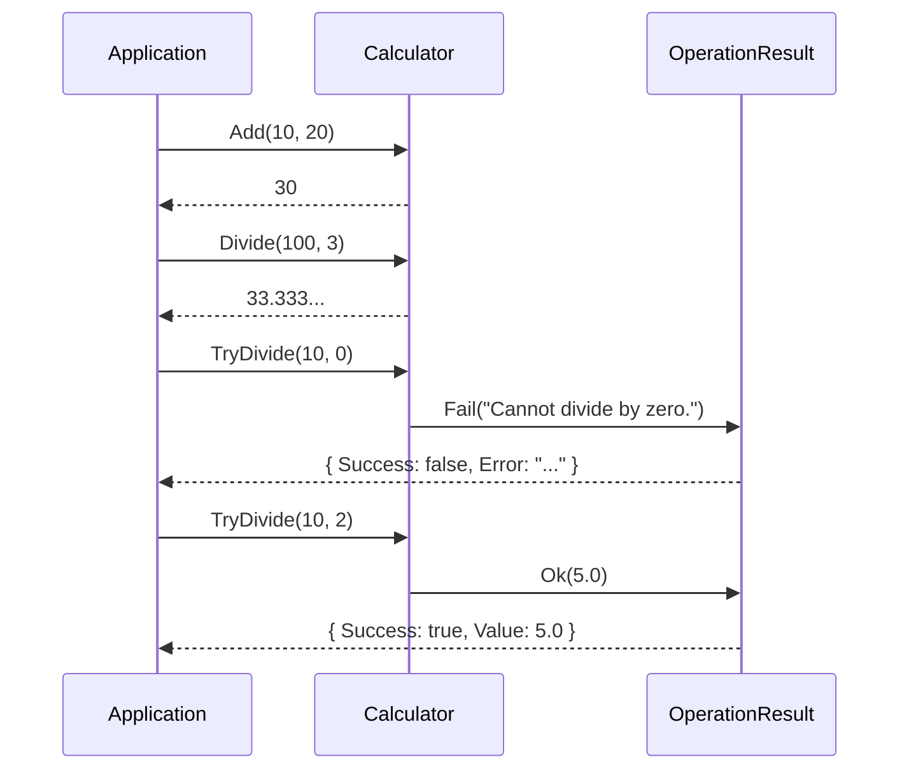
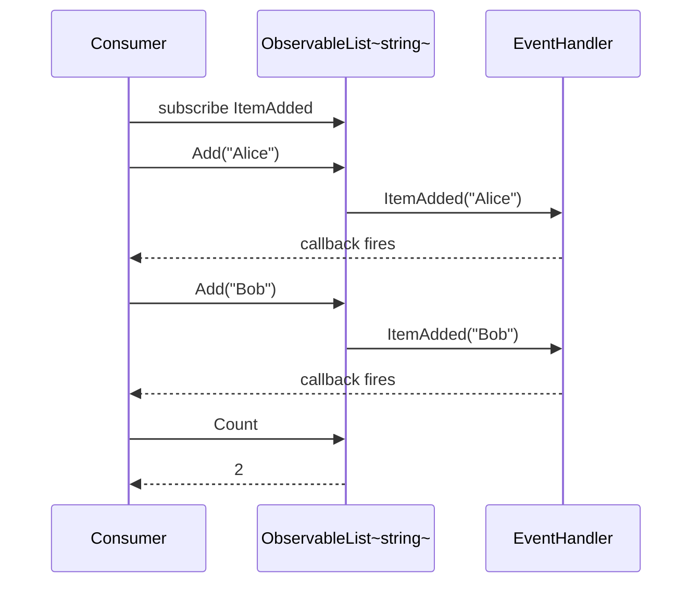
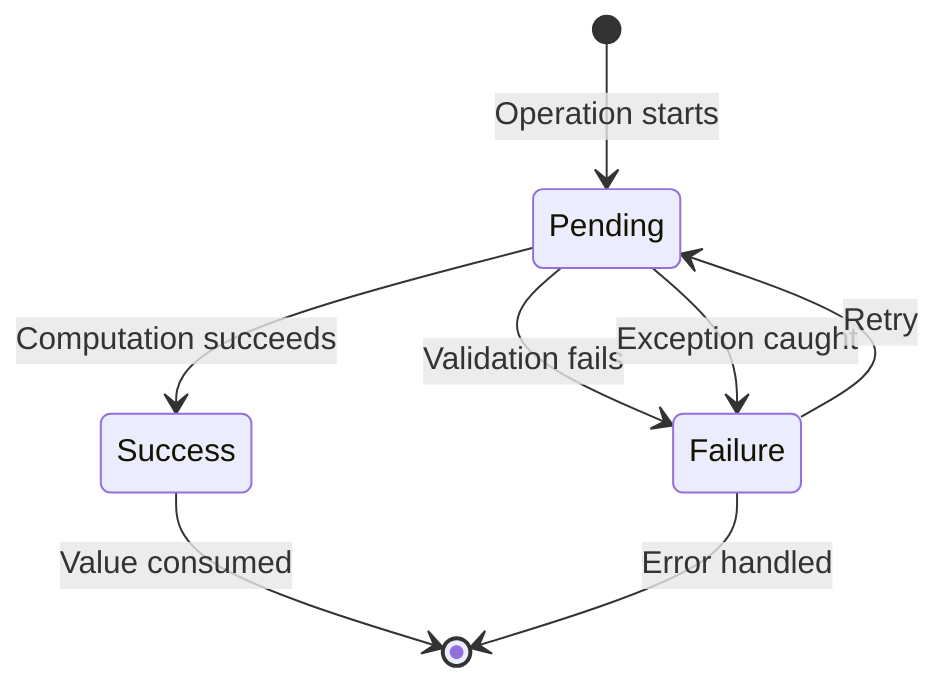
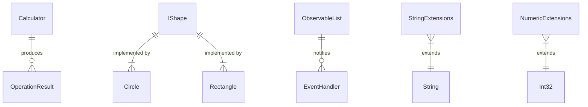

# Diagrams

MokaDocs renders [Mermaid](https://mermaid.js.org/) diagrams as SVG automatically. This page provides practical diagrams that map directly to the SampleLibrary architecture.

## Data Flow

How a calculation request moves through SampleLibrary:

## Class Diagram

The full type hierarchy of SampleLibrary:

## Sequence Diagram — Calculator Usage

A typical interaction between application code and the Calculator:

## Sequence Diagram — Observable List Events

How events fire when items are added to an ObservableList:

## State Diagram — OperationResult Lifecycle

The possible states of an `OperationResult<T>`:

## Entity Relationship Diagram

How the library types relate to each other:

